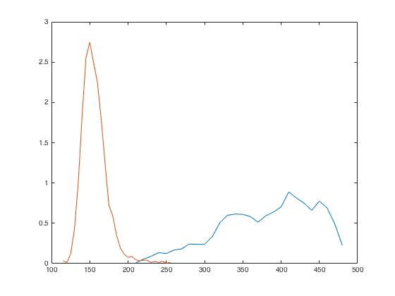

# Statistical Analysis of MRI Data

***Author: Syeda Warda Taqdees***

***Contributor/s: Dr. Christina Tuke Flanders***

### Learning Objectives

After completing this lesson, students should be able to

*   Normalize MRI data for implementing image processing methods.
*   Create color-coded masks for image regions.
*   Calculate statistical parameters such as mean voxel values of image regions.
*   Display histograms of image regions for quantitative ROI analysis. 
*   Calculate and display empirical probability distributions of image regions.
_____________________________________________________________________________

We can detect pathology in MRI image by calculating statistical properties of abnormal tissue and comparing them with the properties of a healthy tissue sample.

## Color-Coding ROIs

First, we select two ROIs in slice#15 of the given dataset using imfreehand(). Voxels from each regions are assigned a unique number, starting from 1, in image mask. We can later use the color-coded mask image to label ROIs.



Let's display the color-coded mask. The green region 'R1' on the right is the pathology and the yellow region 'R2' on left is normal tissue.



## Image Statistical Parameters

After selecting normal and tumor ROIs, lets calculate mean and std of T2 values in both regions. 





Observe that both mean and std values of tumor region are significantly higher than the normal tissue. 

To further investigate the differences in the two image regions, we plot their histograms. The function 'histograms' accepts raw data and plots a histogram with uniform bin width chosen to cover the entire range of value in raw data. The automatic binning algorithm selects an optimal bin width to reveal the underlying data distribution. 



Observe that the histograms are separated, indicating towards the changes in the brain tissue due to tumor. 

## Empirical Probability Distribution

To calculate empirical probability distribution (pdf), we store the histogram information into a 'histogram' object. 



The 'histogram' object is a structure that stores all arguments returned by 'histogram' function. These arguements include bin width, number of bins and bin values. 

Next, we use the information contained in 'histogram' object to calculate empirical pdfs of R1 and R2. 



We plot both empirical pdfs calculated against each bin edge of the histogram.



***Challenge!***
_________________________________________________________________

________________________________________________________________
