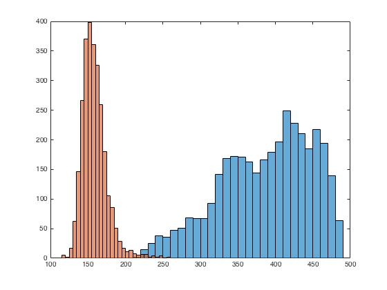

# Statistical Analysis of MRI Data

***Author: Syeda Warda Taqdees***

***Contributor/s: Dr. Christina Tuke Flanders***

### Learning Objectives

After completing this lesson, students should be able to

*   Normalize MRI data for implementing image processing methods.
*   Create color-coded masks for image regions.
*   Calculate statistical parameters such as mean voxel values of image regions.
*   Display histograms of image regions for quantitative ROI analysis. 
*   Calculate and display empirical probability distributions of image regions.
_____________________________________________________________________________

















![](./BookImages/pathoPDF.jpg

