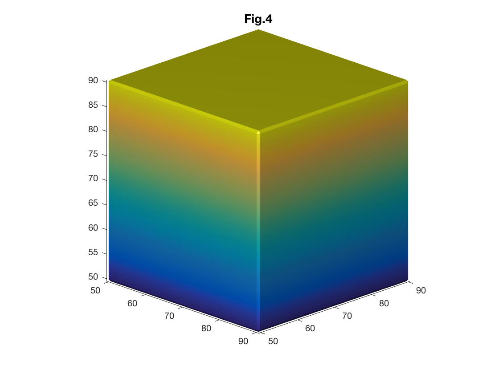

# Part Six: 3D Structural Modeling

**Author: Rosita Shishgar**

**Contributor/s: Warda Syeda**

After finishing this lesson, the students should be able to:
* Demonstrate basic knowledge of 3D volumes and surfaces.
* Extract the 3D surface of a 3D volume.
* Visualise 3D surfaces and color coded surface attributes. 
* Read and write 3D surfaces files in MATLAB.

Anatomical volume is a set of 2D binary masks created from CT or MRI scanner data. The surface model extraction and visualization is commonly used to study the geometry of anatomical structures. In this part, we will study about making 3D volumes and surfaces using MATLAB.

## Simulated data

We are going to create simulated cube volume. The function 'meshgrid' is used to create a 3D rectangular grid. To make the volume, value 1 is assigned to voxels in the 3D space that belong to inside our geometrical shape.



To create a surface from the simulated volume data, 'isosurface' is used. This function accepts a 3D volume and returns faces and vertices of the constructed surface in the form of a triangulated mesh.



To display the constructed surface, 'patch' function creates and visualizes polygons defined by the faces and vertices of the isosurface (see Fig. 1 & Fig. 2-1). 



Certain functions such as 'view', 'camlight' and 'axis' can be used to visually improve the displayed surface. 



Changing patch properties allows us to control and change appearance and behavior of the 3D surface. For instance, 'FaceColor' sets the color of the polygons. 'Edgecolor' controls the color of polygon edges (Fig. 2-2). 



Sometimes, one surface could be hidden behind another surface. Setting 'FaceAlpha' property allows us to control the level of transparency of the object thus making it possible to view the hidden details (Fig. 2-3). 



'patch' also accepts separately specified faces and vertices apart from accepting a whole surface object created by 'isosurface' function (See Fig. 2-4 which presents similar cube as Fig. 2-2).



Instead of using one color for all faces/vertices of the surface, 'FaceVertexCData' property sets one color per face/vertex. It is an important property to visualize surface geometrical features. 

In this example we specify a color for each vertex. Therefore, by setting 'FaceColor' property to 'flat, the color of the first vertex specified determines the face color (Fig. 3).



You can also set 'FaceColor' property to 'interp' which determine the face colors by using a bilinear interpolation of the values at each vertex (Fig. 4).



Predefined MATLAB colormaps can be used to color-code the surface. 
After color-coding the surface, it is useful to separately display a colorbar so that the meaning of each color can easily be understood. A colorbar can be displayed by using the funciton 'colorbar' or pushing the colorbar icon in the figure toolbar (Fig. 5). 



To save a created surface, the triangulated mesh can be converted to commonly used surface file formats such as Polygon File Format (.ply). The function tri_mesh_to_ply accepts a surface object and returns a PLY format structure.



The PLY structure can be saved outside MATLAB using the function 'ply_write'. 



Similarly the simulated volume can be saved as a nifti file for future use. 









## Anatomical data

We can apply what we learned so far on anatomical data such as extracting and visualizing sheep brain surface from its volumetric binary mask, 'sheepBrain.nii'.
!!!!!! Add Code !!!!!

!!!! Add Fig 6 !!!

Another popular surface file format is '.stl'. MATLAB does not have an in-built function for reading .stl files but a function call 'stlread' is available to download from Mathworks website. (This function is provided in lesson repository.) 

!!!! Add code !!!!

!! Add Fig 7 !!!

Similarly, Ply file format can be read into MATALB using the Mathworks function 'ply_read'. 

GIfTI (.gii) is the Geometery format under the NIfTI (.nii) format. It is a surface-file format complement to the NIfTI volume-file format. GIfTI is used in famous medical imaging software packages such as FreeSurfer, Caret and AFNI.

To read '.gii' surface data, a freely available MATLAB function 'gifti' is used. 

!!! Add Code !!!

!!! Add Fig 8 !!!

!!! Challenge 3 !!!!

