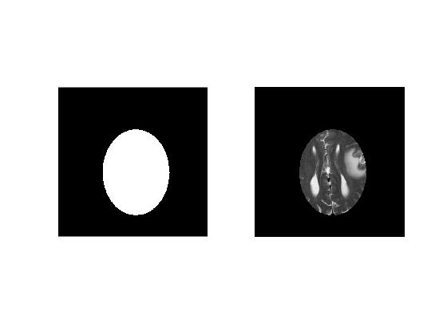
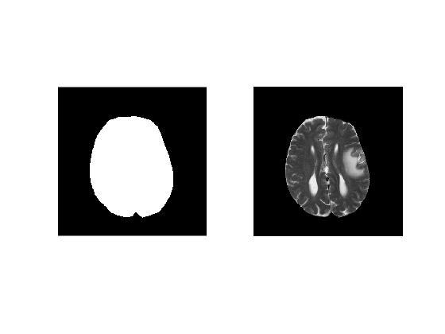
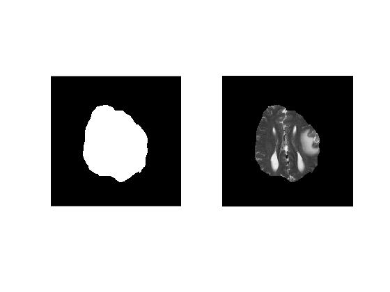
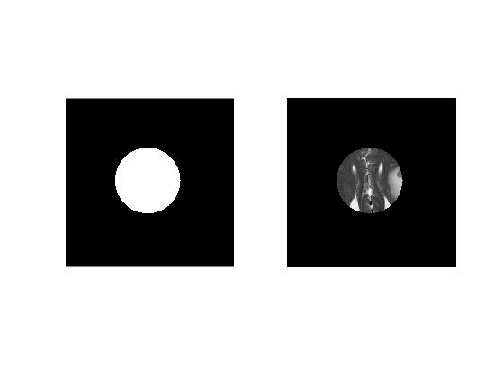
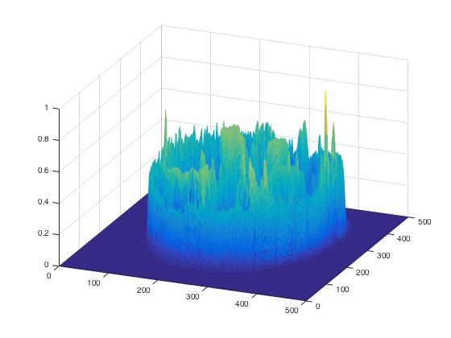
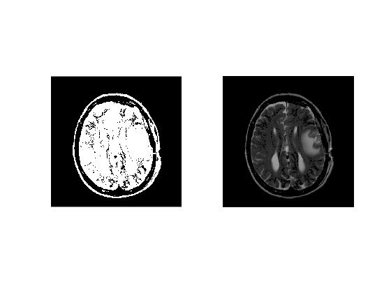
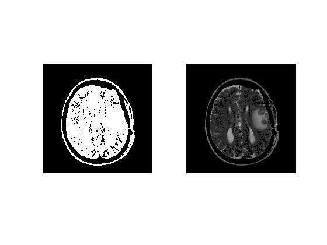
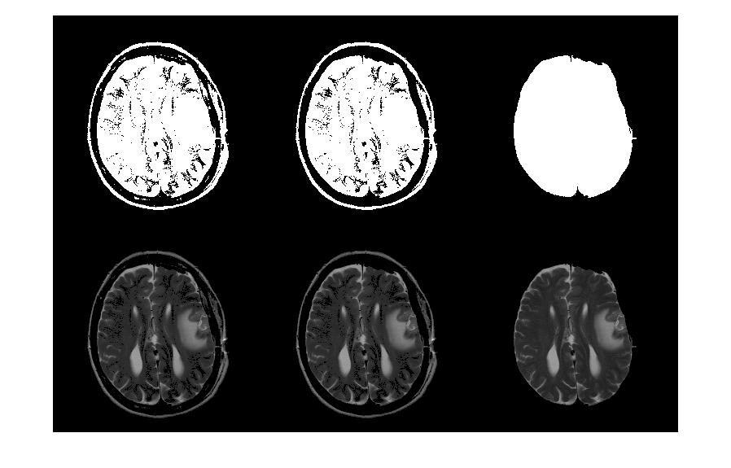

# Masks and Region Of Interests (ROIs)

***Author: Syeda Warda Taqdees***

***Contributor/s: Dr. Christina Tuke Flanders***

### Learning Objectives

After completing this lesson, students should be able to

*   Select an elliptical ROI manually and display it.
*   Manually select a polygonal ROI and adjust its shape interactively.
*   Create draggable freehand region on MRI slice data.
*   Sequentially delineate ROIs in multiple MRI slices.
*   Select and store multiple ROIs on a single image.
*   Learn to use 'regionprops' for measuring properties of image regions.
*   Extract brain and perform skull removal on brain MRI data semi-automatically. 
_____________________________________________________________

## Manual Image Masks
MATLAB's image processing toolbox provides a variety of tool for manually selecting an image ROI.

### Elliptical ROIs

'imellipse()' allows to manually place an ellipse on the image and returns the handle to the 'ellipse' object. The method createMask accepts the ellipse object handle and creates a mask within the image. A mask is a binary image (logical) with 1's assigned to the voxels within ROI and 0's assigned to the voxel outside ROI.



Next we display both Mask image and the selected ROI. We can extract ROI voxels from the image by carrying out voxel-wise multiplication with the binary mask. Notice that we convert '*logical*' mask to '*double*' to ensure compatibility between mask and image datatypes. 



### Polygonal ROIs

'roipoly()' allows us to interactively select a polygonal ROI on image. Every time a click is made on the image, a vertex of the polygon is created at that position. 'roipoly' returns a *logical* binary mask



So far, we have been creating masks on a single slice. Recall that our MRI image dataset consists of multiple slices. All manual selection techniques explained previously can be used in a loop to create binary masks for each slice in the dataset. Note that it is important to save slice mask in each iteration separately. Using this trick, we create a 3D volume mask for our data.



***Challenge!***
_________________________________________________________________

________________________________________________________________

### Freehand ROIs

'imfreehand' is a handy function to draw draggable freehand ROIs on an image. It works similar to 'imellipse' and returns a 'freehand ROI' object which can later be used to create a mask by calling 'createMask' method.



***Challenge!***
______________________________________________________________

_________________________________________________________________

## Semi-automatic ROI Selection

MATLAB image processing toolbox provides useful fucntions for automating ROI selection in MRI images. In this section, we are going to utilize these functions for brain extraction.

### Automatic Ellipse Placement

'imellipse()' also accpets position and size of an elliptical object that can be automatically placed on an image.



### Semi-automatic Brain Extraction

In brain extraction pipeline, first step is to normalize image slice voxels.

**Normalising MRI Image**


**Selecting Binarization Threshold**

In order to create a binary mask for brain region, we need to select an optimal binarization threshold. It means that if the value in a voxel is greater than the threshold values then it will be considered as a brain voxel, otherwise it will be considered an outside voxel.

For selecting an optimal threshold, we create histogram of normalized image intensities. 



Notice that the low intensity background voxels are roughly grouped in the intensity range 0-0.15. 

To check spatial distribution of intensities, I find it useful to create a slice mesh plot.



Based on historgram and meshplot, we select a threshold of 0.15 and create a binary mask.



**Cleaning Binary Mask**



**Selecting Brain Region**









A summary of semi-automatic brain extraction pipeline is presented in the montage below.

***Challenge!***
_________________________________________________________________

_________________________________________________________________