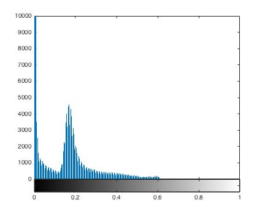

# Masks and Region Of Interests (ROIs)

***Author: Syeda Warda Taqdees***

***Contributor/s: Dr. Christina Tuke Flanders***

### Learning Objectives

After completing this lesson, students should be able to

*   Create a montage of MRI slice data.
*   Display MRI slice data sequentially using 'imagesc' function.
*   Create grid view of MRI slice data using 'subplot'.
*   Index MRI slice data to view in axial, coronal and sagittal directions. 
*   Take Affine transform of coronal and sagittal slices for improving image quality.
*   Display a stack of slice contours with suitable colormaps 

















### Semi-automatic Brain Extraction



















A summary of semi-automatic brain extraction pipeline is presented in the montage below.

